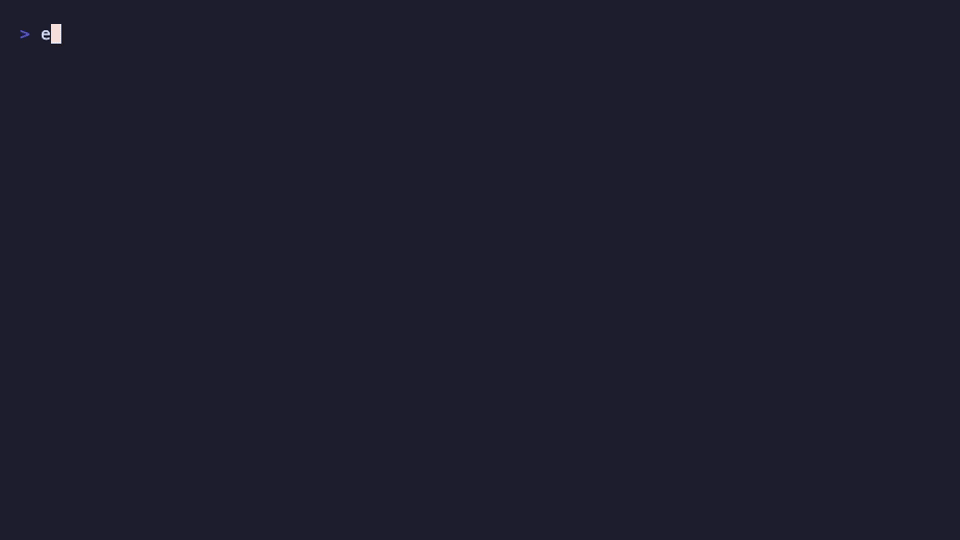

# orch8 Solana

Recoverable Solana operations for workflows that span multiple transactions.



This repository contains:

- `packages/recoverable-operation-builder`: a friendly TypeScript constructor that turns reversible Solana operation definitions into orch8 workflow JSON.
- `packages/solana-worker`: mockable Solana worker handlers for transaction lifecycle, balance checks, failure classification, and recovery actions.
- `demo/constructor-ui`: static browser constructor for sketching recoverable operation sequences and visual recovery flows.
- `demo/recoverable-migration`: a Frontier Hackathon demo showing a DeFi position migration that fails halfway and recovers.

## Why This Exists

A single Solana transaction is atomic. A real user operation is not.

A position migration may withdraw collateral, claim rewards, swap tokens, deposit into a new protocol, and re-enable leverage. If the deposit fails after the first three transactions already completed, the chain cannot recover the user's intent.

orch8 models the whole operation:

- retry transient Solana failures,
- run explicit reverse handlers for reversible steps,
- park assets when rollback is unsafe,
- ask a user or operator when recovery is ambiguous,
- resume from persisted workflow state after downtime.

## Quick Start

Frontier demo:

```bash
npm install
npm run demo:frontier
```

`npm run demo:frontier` runs the deterministic before/after migration demo, regenerates the workflow JSON, starts a temporary local engine, and deploys both generated workflows.

Useful smaller commands:

```bash
npm run build
npm run check
npm run demo:solana-wow
npm run demo:run
npm run demo:build-workflow
npm run demo:build-workflow:verbose
npm run smoke:fresh-clone
npm run validate:constructor
npm run validate:worker-http
npm run validate:local-solana
npm run validate:workflows
npm run validate:devnet-solana   # requires devnet SOL — see script for funding instructions
```

The static constructor UI is at `demo/constructor-ui/index.html`. It can show the operation JSON, generated workflow JSON, and a visual flow of the happy path plus recovery branches.

## Frontier Demo

Category:

> Recoverable DeFi Operations for Solana

Positioning:

> Transactions are atomic; operations are not.

The demo is intentionally small:

1. the unprotected migration fails after assets have moved,
2. the recoverable migration hits the same failure,
3. the recovery branch parks assets instead of leaving the user in an idle partial state,
4. the generated workflow JSON is validated against a local engine.

Recording notes and expected terminal output live in [Frontier demo](docs/crypto/frontier-demo.md). The proof transcript lives in [Demo evidence](docs/crypto/demo-evidence.md).

The committee-facing proof command is:

```bash
npm run demo:solana-wow
```

## Local Binaries

This repo includes local Darwin ARM64 binaries for demo convenience:

```text
bin/darwin-arm64/orch8
bin/darwin-arm64/orch8-server
```

Start the engine locally:

```bash
npm run engine:start
```

Start the mock Solana worker:

```bash
npm run worker:start
```

## Repository Layout

```text
packages/
  recoverable-operation-builder/   # TypeScript constructor → orch8 workflow JSON
    src/index.ts
  solana-worker/                   # mock Solana handlers (HTTP + in-process)
    src/index.ts
    src/handlers.ts
    src/server.ts
    src/steps.ts
demo/
  constructor-ui/
    index.html                     # static browser UI, no build step
  recoverable-migration/
    src/build-workflow.ts
    src/run-demo.ts
    workflows/
scripts/
  lib.ts                           # shared utilities (sleep, waitForExit)
  validate-constructor.ts
  validate-workflows.ts
  validate-local-solana.ts
  validate-worker-http.ts
  validate-devnet-solana.ts
  run-solana-wow-demo.ts
  smoke-fresh-clone.sh
docs/crypto/                       # positioning, demo scripts, patterns
bin/darwin-arm64/                   # local engine binaries (macOS ARM64)
orch8.toml                         # engine configuration
```

## Core Abstraction

Developers describe the operation in business terms:

```ts
const operation = solTransaction({
  name: "defi_migration",
  recoveryPolicy: {
    onFailure: "rollback",
    ifRollbackUnsafe: "park_assets",
    ifAmbiguous: "ask_user",
  },
  steps: [
    reversibleStep({
      id: "withdraw",
      handler: "withdraw_collateral",
      undo: "redeposit_collateral",
    }),
    reversibleStep({
      id: "swap_rewards",
      handler: "swap_rewards_to_usdc",
      undo: "swap_usdc_to_rewards",
      userDecision: userDecision({
        question: "Swap route failed. Retry, roll back, park assets, or wait?",
        choices: ["retry", "rollback", "park_assets", "wait"],
        defaultChoice: "park_assets",
      }),
    }),
    fallbackStep({
      id: "deposit",
      handler: "deposit_protocol_b",
      fallback: "park_in_money_market",
    }),
  ],
});

const sequence = recoverableOperation(operation);
```

The builder generates an orch8 workflow using ordinary blocks such as `step`, `try_catch`, and `router`.

It also generates a readable recovery path:

- text summary: `demo/recoverable-migration/recovery-path.md`
- Mermaid diagram in the same file

The constructor also supports:

- guard checks before risky steps,
- failure classification examples for known Solana failure cases,
- timeout defaults for ambiguous user decisions.

## What Is Real vs Mocked

Real:

- recoverable operation construction,
- generated orch8 workflow shape,
- explicit forward/reverse/recovery handlers,
- deterministic failure and recovery state model,
- HTTP worker validation through `/reset`, `/handlers/*`, and `/state`.
- local Solana validator smoke test with airdrop, transfer, confirmation, and balance checks.

Mocked for the hackathon demo:

- protocol balances,
- Protocol B capacity,
- DeFi protocol transaction effects,
- money market parking.

## Frontier Demo Story

The demo shows:

1. an unprotected DeFi migration that fails at deposit,
2. the same migration built as a recoverable operation,
3. retry, recovery branch, asset parking, and eventual completion.

## Product Category

orch8 Solana is aimed at:

> Recoverable DeFi Operations for Solana

The primary painful flow is position migration because it naturally demonstrates retries, reversible steps, fallback recovery, asset parking, and user/operator decisions.

For more examples, see:

- [Frontier demo](docs/crypto/frontier-demo.md)
- [Demo evidence](docs/crypto/demo-evidence.md)
- [AutoDAO expansion](docs/crypto/autodao-expansion.md)
- [Multi-step flow opportunities](docs/crypto/multistep-flow-opportunities.md)
- [Recovery patterns](docs/crypto/recovery-patterns.md)
- [Flow templates](docs/crypto/flow-templates.md)
- [Solana wow demo](docs/crypto/wow-demo.md)
- [Post-hackathon HN outline](docs/crypto/post-hackathon-hn-outline.md)
- [Action points](docs/crypto/action-points.md)

## License

Private repository. All rights reserved.
