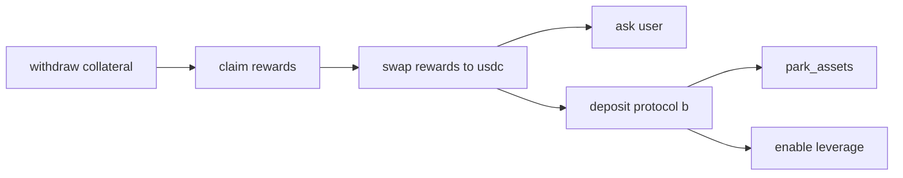

# Recoverable Migration Path

Operation: defi_migration_recoverable

- withdraw_collateral: do 'withdraw_collateral'
  - guard checks: check_asset_owner, check_withdrawable_balance
  - if a later step fails: can undo with 'redeposit_collateral'
  - if this step fails: park_assets
- claim_rewards: do 'claim_rewards'
  - not reversible
  - if this step fails: rollback via redeposit_collateral
- swap_rewards: do 'swap_rewards_to_usdc'
  - if a later step fails: can undo with 'swap_usdc_to_rewards'
  - if this step fails: ask user 'Swap route failed. Retry, roll back, park assets, or wait?'
  - if no answer in 300s: park_assets
  - failure classes: blockhash_not_found -> rollback, slippage_exceeded -> ask_user, user_timeout -> park_assets
- deposit_protocol_b: do 'deposit_protocol_b'
  - guard checks: check_protocol_capacity
  - not reversible
  - if this step fails: recover with 'park_assets'
  - failure classes: priority_fee_too_low -> rollback, protocol_capacity_full -> park_assets
- enable_leverage: do 'enable_leverage'
  - not reversible
  - if this step fails: rollback via swap_usdc_to_rewards -> redeposit_collateral

