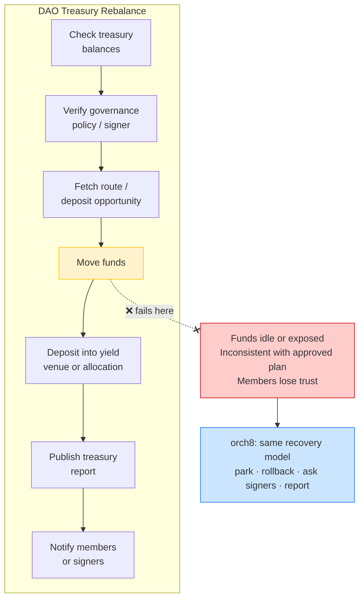

# AutoDAO Expansion

AutoDAO is an expansion story after the recoverable DeFi migration demo. It should not replace the primary demo because DAO treasury operations add governance context, signer coordination, and reporting expectations.

## Why It Fits



## Constructor Definition

```ts
solTransaction({
  name: "dao_treasury_rebalance",
  namespace: "solana_demo",
  recoveryPolicy: {
    onFailure: "rollback",
    ifRollbackUnsafe: "ask_user",
    ifAmbiguous: "ask_user",
  },
  steps: [
    step({
      id: "check_treasury_balances",
      handler: "check_treasury_balances",
    }),
    step({
      id: "verify_governance_policy",
      handler: "verify_governance_policy",
      guards: [
        guard({
          id: "policy_approval",
          handler: "verify_governance_policy",
        }),
      ],
    }),
    reversibleStep({
      id: "deposit_treasury_yield",
      handler: "deposit_treasury_yield",
      undo: "return_to_treasury",
      userDecision: userDecision({
        question: "Treasury rebalance is ambiguous. Continue, return funds, park assets, or wait?",
        choices: ["continue", "rollback", "park_assets", "wait"],
        defaultChoice: "rollback",
        timeoutSeconds: 600,
        onTimeout: "rollback",
      }),
      failure: failureClassification({
        classifyWith: "classify_solana_failure",
        examples: [
          {
            code: "policy_approval_missing",
            kind: "unsafe",
            recovery: "ask_user",
            note: "Signer or governance approval is missing.",
          },
          {
            code: "priority_fee_too_low",
            kind: "transient",
            recovery: "rollback",
            note: "Retry only while the approved route remains valid.",
          },
          {
            code: "slippage_exceeded",
            kind: "market_moved",
            recovery: "ask_user",
            note: "The execution no longer matches the approved terms.",
          },
        ],
      }),
    }),
    step({
      id: "publish_treasury_report",
      handler: "publish_treasury_report",
    }),
  ],
});
```

## Mock Worker Handlers

The mock worker exposes these handler names:

- `check_treasury_balances`
- `verify_governance_policy`
- `deposit_treasury_yield`
- `return_to_treasury`
- `publish_treasury_report`

They are intentionally simple. Their purpose is to show that the same recovery model works when the asset owner is a DAO and the final step includes member-facing reporting.

## Demo Priority

Keep AutoDAO out of the 3-minute recording unless the position migration story is already polished. It is best used as a "next category" proof:

> Recoverability applies to any Solana operation where intent spans more than one transaction.
