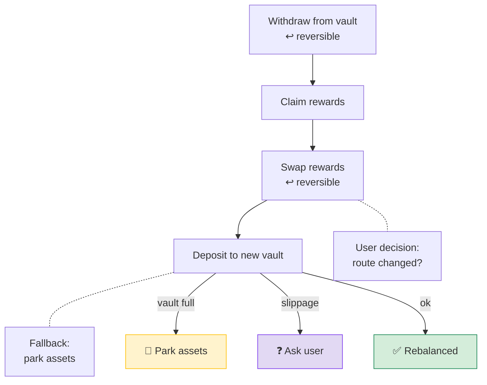
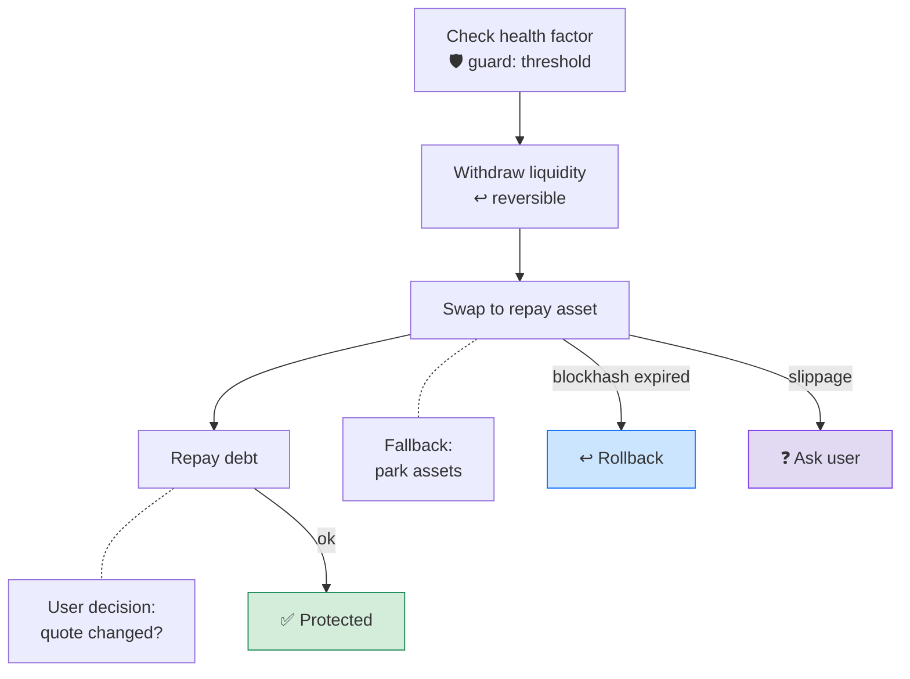

# Flow Templates

These templates are second-screen examples. The primary demo should stay focused on recoverable position migration.

## Yield Rebalancing



Constructor shape:

```ts
solTransaction({
  name: "yield_rebalance",
  steps: [
    reversibleStep({
      id: "withdraw_from_vault",
      handler: "withdraw_from_vault",
      undo: "deposit_back_to_vault",
      guards: [
        guard({
          id: "receipt_balance",
          handler: "check_receipt_balance",
        }),
      ],
    }),
    step({
      id: "claim_rewards",
      handler: "claim_rewards",
    }),
    reversibleStep({
      id: "swap_rewards",
      handler: "swap_rewards_to_target_asset",
      undo: "swap_target_asset_to_rewards",
      userDecision: userDecision({
        question: "Route changed. Continue with new quote, roll back, or park assets?",
        choices: ["continue", "rollback", "park_assets"],
        defaultChoice: "park_assets",
        timeoutSeconds: 300,
        onTimeout: "park_assets",
      }),
    }),
    fallbackStep({
      id: "deposit_to_new_vault",
      handler: "deposit_to_new_vault",
      fallback: "park_assets",
      guards: [
        guard({
          id: "vault_capacity",
          handler: "check_vault_capacity",
        }),
      ],
      failure: failureClassification({
        classifyWith: "classify_solana_failure",
        examples: [
          {
            code: "vault_capacity_full",
            kind: "capacity",
            recovery: "park_assets",
          },
          {
            code: "slippage_exceeded",
            kind: "market_moved",
            recovery: "ask_user",
          },
        ],
      }),
    }),
  ],
});
```

Recovery idea:

- Retry transient network or fee failures.
- Ask user when APY, quote, or route meaningfully changed.
- Park assets if the destination vault is temporarily unavailable.

## Liquidation Protection



Constructor shape:

```ts
solTransaction({
  name: "liquidation_protection",
  recoveryPolicy: {
    onFailure: "park_assets",
    ifAmbiguous: "ask_user",
  },
  steps: [
    step({
      id: "check_health_factor",
      handler: "check_health_factor",
      guards: [
        guard({
          id: "below_threshold",
          handler: "check_liquidation_threshold",
        }),
      ],
    }),
    reversibleStep({
      id: "withdraw_available_liquidity",
      handler: "withdraw_available_liquidity",
      undo: "redeposit_available_liquidity",
    }),
    fallbackStep({
      id: "swap_to_repay_asset",
      handler: "swap_to_repay_asset",
      fallback: "park_assets",
      failure: failureClassification({
        classifyWith: "classify_solana_failure",
        examples: [
          {
            code: "blockhash_not_found",
            kind: "transient",
            recovery: "rollback",
          },
          {
            code: "slippage_exceeded",
            kind: "market_moved",
            recovery: "ask_user",
          },
        ],
      }),
    }),
    step({
      id: "repay_debt",
      handler: "repay_debt",
      userDecision: userDecision({
        question: "Repay route changed. Repay with new quote, park assets, or wait?",
        choices: ["repay", "park_assets", "wait"],
        defaultChoice: "park_assets",
        timeoutSeconds: 120,
        onTimeout: "park_assets",
      }),
    }),
  ],
});
```

Recovery idea:

- Do not retry forever near a liquidation window.
- Use guards before every risk-increasing action.
- Prefer a safe parked state over a stale retry when market conditions changed.
