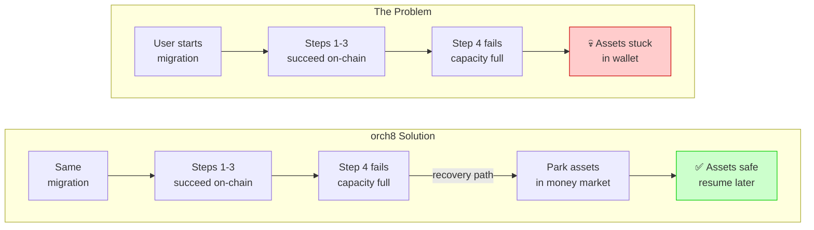
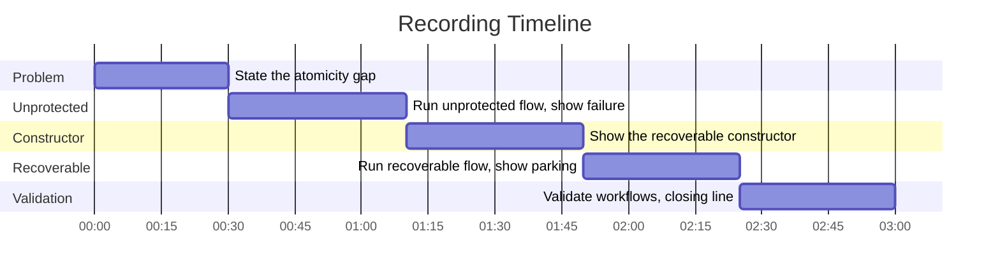

# Frontier Demo

Category:

> Recoverable DeFi Operations for Solana

Positioning:

> Transactions are atomic; operations are not.

## One Command

```bash
npm install
npm run demo:frontier
```

The command runs the deterministic migration demo, regenerates the workflow JSON, starts a temporary local engine, and validates that the generated workflows deploy.

No live network dependency is required.

The proof transcript and recording placeholder are in [Demo evidence](demo-evidence.md).

## How It Works



## Demo Output

Expected terminal shape:

```text
Recoverable Position Migration Demo
====================================

Unprotected migration
Initial: wallet=0, protocolA=100, protocolB=0, moneyMarket=0, usdc=0
ok   withdraw_collateral: withdrawn
ok   claim_rewards: rewards_claimed
ok   swap_rewards: swapped
fail deposit_protocol_b: protocol_b_capacity_full - Protocol B is temporarily at capacity
Stopped with assets idle: wallet=100, protocolA=0, protocolB=0, moneyMarket=0, usdc=5

Recoverable migration
Initial: wallet=0, protocolA=100, protocolB=0, moneyMarket=0, usdc=0
ok   withdraw_collateral: withdrawn
ok   claim_rewards: rewards_claimed
ok   swap_rewards: swapped
fail deposit_protocol_b: protocol_b_capacity_full - Protocol B is temporarily at capacity
recovery deposit_protocol_b: park_assets
ok   park_assets: parked_assets
Recovered with assets parked: wallet=0, protocolA=0, protocolB=0, moneyMarket=100, usdc=5

Validated generated workflows against local orch8 engine
```

## What Is Real vs Mocked

Real:

- recoverable operation constructor,
- generated orch8 workflow JSON,
- retry, rollback, fallback, and user-decision branches,
- local workflow validation against the bundled engine,
- deterministic state transitions for failure and recovery.

Mocked:

- protocol balances,
- Protocol B capacity,
- Solana transaction effects,
- money market parking.

## Three-Minute Recording Script



**0:00-0:30 — State the problem.**
Solana transactions are atomic, but user operations usually span many transactions. If step four fails, the user's intent is only half-completed.

**0:30-1:10 — Run the unprotected flow.**
Show `npm run demo:run`. Withdraw, claim, and swap succeed, then Protocol B rejects the deposit. The chain did exactly what each transaction asked, but the operation failed.

**1:10-1:50 — Show the recoverable constructor.**
Open `demo/recoverable-migration/src/build-workflow.ts`. Show `solTransaction`, `reversibleStep`, `fallbackStep`, `retryPolicy`, and `userDecision`. Developers describe the operation in business terms; the builder emits deployable workflow JSON.

**1:50-2:25 — Run the recoverable flow.**
Same failure at Protocol B, then the recovery branch parks assets. The failure didn't disappear; the operation had an explicit recovery path.

**2:25-3:00 — Validate the workflow.**
Run `npm run demo:frontier`. Show both workflow files accepted by the local engine. Close: transactions are atomic; operations are not.
