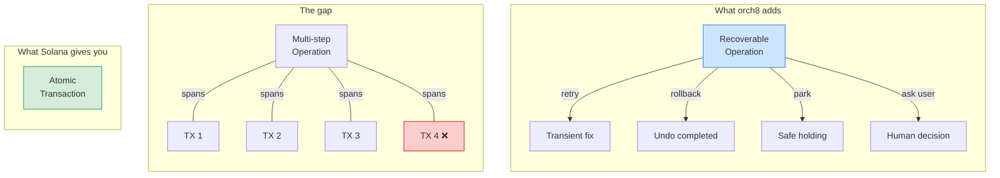
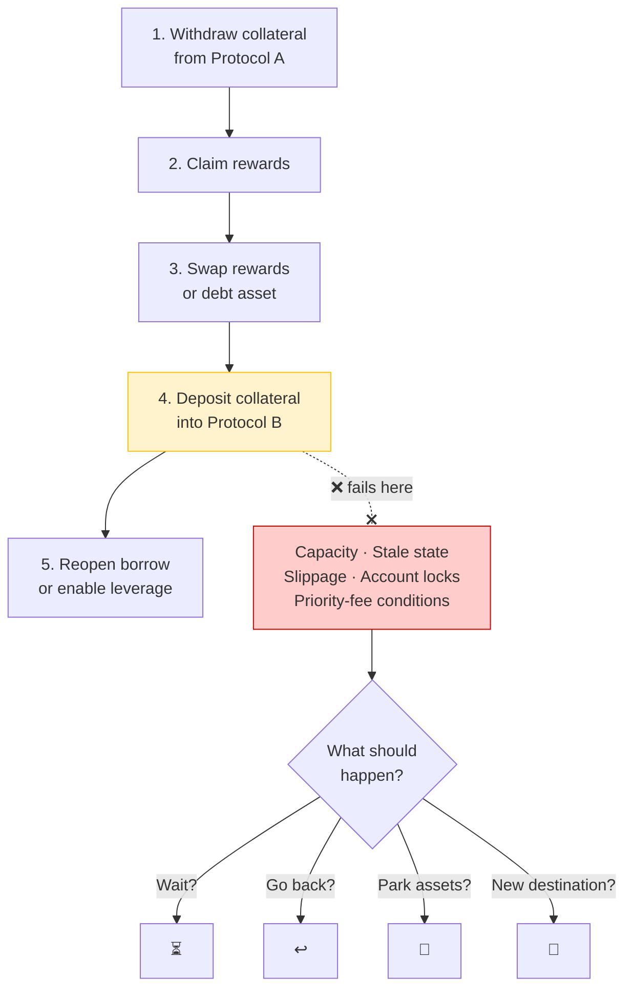
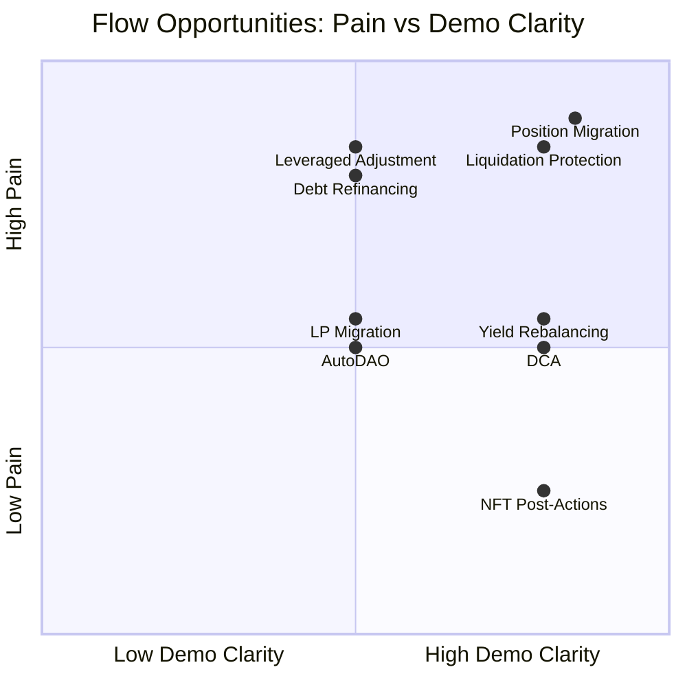

# Multi-Step Flow Opportunities

The core opportunity is to position orch8 around recoverable DeFi operations, not generic Solana automation.

> DeFi users do not perform transactions. They perform operations. Transactions are atomic; operations are not.

Solana gives developers atomic transactions. It does not automatically recover a user's broader intent when a workflow spans several transactions, protocols, quotes, confirmations, and off-chain services. That gap is where orch8 fits.



## Best Demo Anchor: Recoverable Position Migration

Use position migration as the primary Frontier demo because it is concrete, financially meaningful, and naturally exercises the recoverable operation abstraction.



The chain cannot infer the user's intent. orch8 makes the recovery explicit:

- Retry transient failures.
- Run reverse handlers for completed reversible steps.
- Park assets when rollback is unsafe.
- Ask the user or operator when the right recovery path is ambiguous.
- Resume later from persisted workflow state.

## Other Painful Multi-Step Flows

### 1. Leveraged Position Adjustment

Increase or decrease leverage safely.

Steps:

- Borrow asset.
- Swap borrowed asset.
- Deposit more collateral.
- Refresh health factor.
- Repeat until target leverage is reached.

Pain:

- Slippage, oracle movement, compute limits, or partial execution can leave the user at the wrong leverage.
- A normal retry can make the position worse if market conditions changed.

orch8 angle:

- Use `reversible_step` for each move.
- Use a health-factor guard before continuing.
- Ask the user if the target leverage is no longer safe.

### 2. Debt Refinancing

Move debt from one market to another.

Steps:

- Borrow cheaper asset.
- Swap if needed.
- Repay old debt.
- Withdraw old collateral.
- Deposit new collateral.
- Open or adjust new debt.

Pain:

- If repayment succeeds but redeposit fails, the user loses the intended exposure and may have idle collateral.
- If borrow succeeds but repay fails, the user may temporarily hold extra debt.

orch8 angle:

- Treat each debt move as a reversible or guarded step.
- Roll forward into a safer market if rollback would increase risk.

### 3. Liquidation Protection

Defensive automation when a position becomes unsafe.

Steps:

- Detect health-factor threshold.
- Withdraw available liquidity.
- Swap asset.
- Repay debt.
- Optionally move collateral.
- Notify user.

Pain:

- Timing is critical.
- Failed swaps, stale prices, or RPC inconsistency can make the rescue fail.
- Retrying blindly can waste the liquidation window.

orch8 angle:

- Classify failure type.
- Retry only transient errors.
- Escalate or ask user when price movement changes the strategy.

### 4. Yield Strategy Rebalancing

Move funds from a lower-yield opportunity to a better one.

Steps:

- Withdraw from vault.
- Claim rewards.
- Swap reward token.
- Deposit into new vault.
- Stake receipt token.
- Update accounting.

Pain:

- Destination vault capacity, deposit limits, reward-claim failures, or changing APY can produce ugly partial states.

orch8 angle:

- Use a recovery branch to park assets if the destination is temporarily unavailable.
- Resume when capacity opens.

### 5. Liquidity Provision Migration

Move liquidity between pools or DEXes.

Steps:

- Remove liquidity.
- Collect fees.
- Swap to target ratio.
- Add liquidity to new pool.
- Stake LP token.

Pain:

- Price moves between removal and re-addition.
- Failed add-liquidity can leave the user holding the wrong token ratio.

orch8 angle:

- Guard token ratios before adding liquidity.
- Ask the user if slippage exceeds tolerance.
- Roll forward into a parking position if the target pool becomes unsafe.

### 6. DCA or Recurring Execution

Scheduled buys or sells with recoverability.

Steps:

- Check balance.
- Fetch quote.
- Submit swap.
- Confirm transaction.
- Record execution.
- Retry or notify if failed.

Pain:

- Cron can fire again without understanding whether the previous attempt partially completed.
- A failed record step can cause duplicate execution or missed accounting.

orch8 angle:

- Persist execution state.
- Memoize completed outputs.
- Avoid duplicate swaps after crashes or retries.

### 7. NFT Mint or Claim With Post-Actions

Less DeFi-focused, but understandable for non-DeFi audiences.

Steps:

- Mint NFT.
- Verify ownership.
- Stake NFT.
- Claim bonus or reward.
- Update app state.

Pain:

- Mint succeeds but staking or reward claim fails.
- The user thinks the app broke even though the on-chain mint succeeded.

orch8 angle:

- Recover the post-mint steps.
- Notify the user with a clear next action.

### 8. AutoDAO Treasury Rebalancing

Use this only after the recoverable DeFi migration demo works. AutoDAO is the expansion story, not the first proof.

Steps:

- Check DAO treasury balances.
- Verify policy, proposal, or signer approval.
- Fetch swap or deposit quote.
- Swap treasury asset.
- Deposit into yield venue or safe allocation.
- Publish treasury report.
- Notify members or signers.

Pain:

- DAO treasury actions are slow, visible, and politically sensitive.
- A partial rebalance can leave funds idle, exposed, or inconsistent with the proposal members approved.
- If execution succeeds but reporting fails, members lose trust.
- If quote, swap, or deposit fails, an operator needs a safe next action instead of a vague "transaction failed."

orch8 angle:

- Treat DAO treasury actions as recoverable autonomous operations.
- Ask signers when recovery is ambiguous.
- Park funds or return to treasury when the target route is unsafe.
- Produce an execution record after every recovery path.

Example constructor:

```ts
recoverableOperation({
  name: "dao_treasury_rebalance",
  recoveryPolicy: {
    onFailure: "ask_user",
    ifRollbackUnsafe: "park_assets",
    ifAmbiguous: "ask_user",
  },
  steps: [
    { id: "check_treasury", do: "check_treasury_balances" },
    { id: "verify_policy", do: "verify_governance_policy" },
    { id: "swap_usdc_to_sol", do: "swap_usdc_to_sol", undo: "swap_sol_to_usdc" },
    { id: "deposit_yield", do: "deposit_to_yield_vault", fallback: "return_to_treasury" },
    { id: "publish_report", do: "publish_treasury_report" }
  ]
});
```

Positioning:

> After DeFi recovery is proven, the same abstraction becomes recoverable autonomous operations for DAO treasuries.

## Opportunity Ranking



| Flow | Demo clarity | Pain intensity | Fits abstractions | Recommended use |
|---|---:|---:|---:|---|
| Position migration | High | High | High | Primary demo |
| Leveraged adjustment | Medium | High | High | Advanced example |
| Debt refinancing | Medium | High | High | README example |
| Liquidation protection | High | High | Medium | Future demo |
| Yield rebalancing | High | Medium | High | Secondary demo |
| LP migration | Medium | Medium | High | Blog/example |
| DCA | High | Medium | Medium | Simple starter template |
| NFT post-actions | High | Low | Medium | Non-DeFi explanation |
| AutoDAO treasury rebalancing | Medium | Medium | High | Least-priority expansion |

## Category Definition

orch8 should own:

> Recoverable DeFi Operations for Solana

This is stronger than "Solana worker steps" because it names the user's painful outcome: an operation that fails halfway through.

After the DeFi demo works, AutoDAO can expand the category to:

> Recoverable Autonomous Operations for Solana

Do not lead with this broader category before the first DeFi demo is executable. It is useful as a "where this goes next" example.

## Positioning Rules

Say:

- "Transactions are atomic; operations are not."
- "orch8 recovers user intent across multi-transaction workflows."
- "Rollback means explicit compensating transactions, not rewriting chain history."
- "Developers mark what is reversible; orch8 decides whether to retry, reverse, park, ask, or resume."

Avoid:

- "We undo Solana transactions."
- "Smart contracts cannot retry."
- "No one else does this."
- Unsupported failure-rate statistics.
