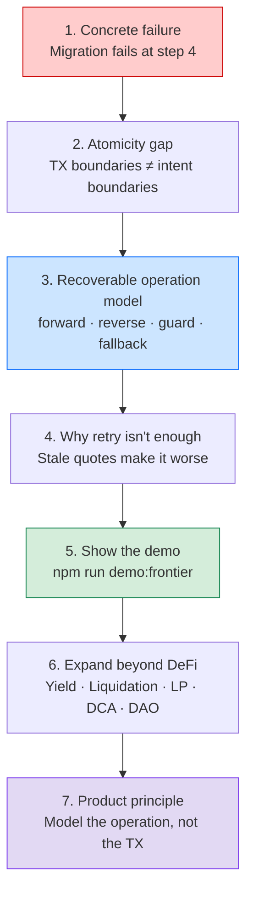

# Post-Hackathon HN Outline

Working title:

> Transactions are atomic. User operations are not.

## Thesis

Solana gives developers fast, atomic transactions. Product teams still have to manage user intent across multiple transactions, quotes, confirmations, protocol limits, app servers, and timeouts.

The missing abstraction is not another retry loop. It is a recoverable operation: retry where safe, roll back where possible, park assets when rollback is unsafe, and ask the user when intent is ambiguous.

## Outline



**1. Open with the concrete failure.**
A DeFi position migration withdraws collateral, claims rewards, swaps, then fails while depositing into the destination protocol. Each transaction did its job. The operation still failed.

**2. Explain the atomicity gap.**
Atomic transactions protect a single transaction boundary. They do not preserve intent across a workflow with multiple on-chain and off-chain steps.

**3. Show the recoverable operation model.**
The operation should declare: forward steps, reverse steps, guard checks, retry policy, fallback path, user decision path, and timeout defaults.

**4. Show why retry is not enough.**
Retrying a stale quote, a full destination vault, or a changed market route can make the outcome worse. Some failures need rollback, some need parking, and some need user input.

**5. Show the demo.**

```bash
npm run demo:frontier
```

**6. Expand beyond the demo.**
The same pattern applies to yield rebalancing, liquidation protection, liquidity migration, recurring execution, NFT post-actions, and DAO treasury operations.

**7. Close with the product principle.**
Developers should model the user's operation, not just the next transaction.

## Notes For Tone

- Keep it practical and engineering-led.
- Avoid hype.
- Use the failure transcript as evidence.
- Make the central idea memorable: transactions are atomic; operations are not.
- Ask for critique on the abstraction, not praise for the demo.
