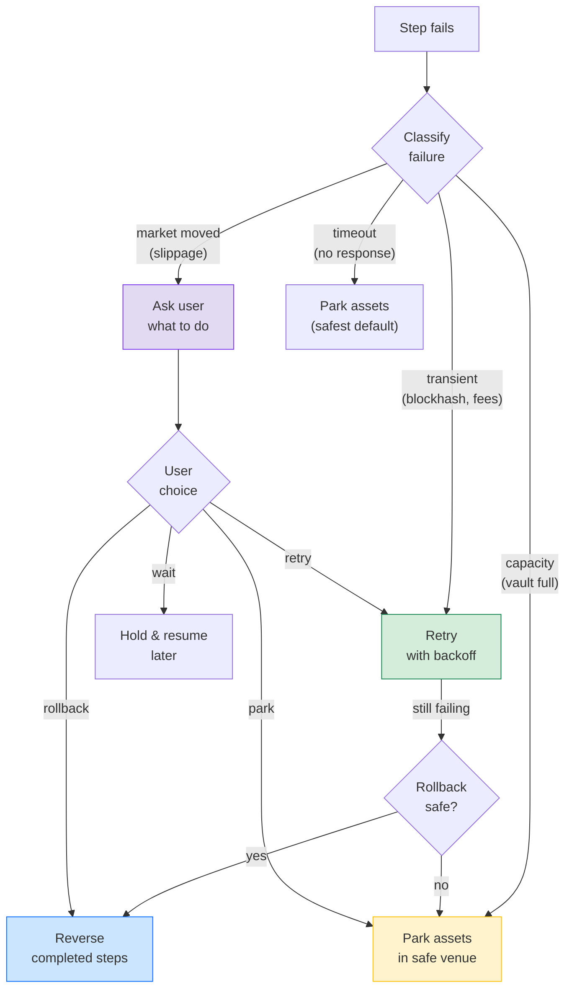

# Recovery Patterns

These patterns keep the constructor focused on real multi-step operation pain: retries alone are not enough when part of the user's intent has already executed.



## Asset Guards

Guards run before the forward step.

Use guards for:

- asset ownership,
- withdrawable balance,
- destination capacity,
- health factor,
- slippage tolerance,
- signer or policy approval.

Example:

```ts
reversibleStep({
  id: "withdraw_collateral",
  handler: "withdraw_collateral",
  undo: "redeposit_collateral",
  guards: [
    guard({
      id: "withdrawable_balance",
      handler: "check_withdrawable_balance",
      params: { minimum_collateral: 100 },
    }),
  ],
});
```

## Failure Classification

Failure classification records known failure cases and their intended recovery path. The generated workflow can add a classification step before rollback, fallback, or user decision.

Useful examples:

| Failure | Kind | Recovery |
| --- | --- | --- |
| `blockhash_not_found` | `transient` | `rollback` or retry while quote is fresh |
| `priority_fee_too_low` | `transient` | `rollback` or retry with a higher fee |
| `slippage_exceeded` | `market_moved` | `ask_user` |
| `protocol_capacity_full` | `capacity` | `park_assets` |
| `user_timeout` | `user_timeout` | `park_assets` |

Example:

```ts
failureClassification({
  classifyWith: "classify_solana_failure",
  examples: [
    {
      code: "slippage_exceeded",
      kind: "market_moved",
      recovery: "ask_user",
      note: "The route changed and may no longer match the user's intent.",
    },
  ],
});
```

## User Decision Timeout

Ambiguous recovery should not wait forever. User decisions include a timeout and a default timeout action.

Example:

```ts
userDecision({
  question: "Swap route failed. Retry, roll back, park assets, or wait?",
  choices: ["retry", "rollback", "park_assets", "wait"],
  defaultChoice: "park_assets",
  timeoutSeconds: 300,
  onTimeout: "park_assets",
});
```

For financial operations, `park_assets` is the safest default when the system cannot prove that rollback or retry still matches the user's intent.
