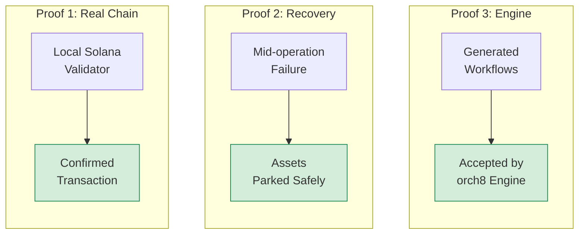

# Solana Wow Demo

This is the committee-facing proof command:

```bash
npm run demo:solana-wow
```

It combines three proofs in one run:



## Expected Transcript Shape

```text
orch8 Solana Wow Demo
======================

1. Starting local Solana validator
   Confirmed transfer: <signature>
   Receiver balance: 100000000 lamports

2. Running recoverable migration proof
   Failure: protocol_b_capacity_full
   Recovery path: park_assets
   Unprotected state: wallet=100, protocolA=0, protocolB=0, moneyMarket=0, usdc=5
   Recovered state:   wallet=0, protocolA=0, protocolB=0, moneyMarket=100, usdc=5

3. Validating generated workflows against local engine
   Workflow validation passed

Proof                                      Status
----------------------------------------   ------
Local Solana validator reachable           OK
Real transaction confirmed                 OK
Multi-step operation failed mid-flight      OK
Recovery branch executed                   OK
Workflow accepted by local engine          OK
```

## Committee Line

> Solana makes transactions atomic. orch8 makes user operations recoverable.

## Why This Is Stronger Than The Basic Demo

The basic demo proves the recoverable operation model.

The wow demo also proves the repo can touch a Solana runtime locally. It does not pretend to be a full DeFi integration; it proves the critical objection is handled:

> This is not only a fake workflow. There is a real local Solana transaction in the proof path.

## What Is Still Mocked

- Protocol A and Protocol B balances.
- Protocol B capacity failure.
- Money market parking.

Those are intentionally mocked so the demo stays deterministic. The real-chain proof is the validator transaction, while the recoverable operation proof is the deterministic migration failure and recovery path.
